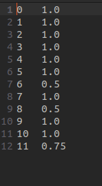

# Large Scale Computation For Graph Similarity

### AUTHOR : Aliasgar Zakir Merchant
### EMAIL : [amerch23@uic.edu]()

# Overview
*THE CODE IS WORKING AS A STANDALONE ON HADOOP AND NOT ON AWS.*

This repository provides an implementation of a Large Scale Computation for Graph Similarity. The program runs using
`SCALA version 3.3.1` and `SBT version 1.9.2`. 

This repository and code was built on Ubuntu 22.04 and hence the **ReadMe** is created considering that you would run
the program on an Ubuntu system.

# Necessary Prerquisites
In order to run this repository on one's system, you must install the following dependencies:
- [Scala](https://www.scala-lang.org/download/) ver 3.3.1
- [SBT](https://www.scala-sbt.org/release/docs/Setup.html) ver 1.9.2
- [JDK/JVM](https://docs.oracle.com/en/java/javase/) ver 11.0
- [Hadoop](https://hadoop.apache.org) ver 3.3.6

## - Setup Repository
- Once the prerequisites are met, clone this repository using the command `git clone`.
- Since this project was built in Hadoop there will be a number of changes that you must perform to you Hadoop files
before the system is functioning on your PC.
- These changes will be explained in the upcoming section.

## - Setup Hadoop
### Initial System Setup
- First, you need to run the command `java --version` in order to determine if java has been installed on your PC.
- If not installed then you can install JAVA using `sudo apt install openjdk-11-jdk -y`
- Install OpenSSH using `sudo apt install openssh-server openssh-client -y`
- Then, generate public and private keys using `ssh-keygen -t rsa`.
- Add this public key to ***authorized keys** using `sudo cat ~/.ssh/id_rsa.pub >> ~/.ssh/authorized_keys`
- Next change the permission of the file using `sudo chmod 640 ~/.ssh/authorized_keys`
- Next, get the location of the `JAVA_HOME` using the command `dirname $(dirname $(readlink -f $(which java)))`

### Configuring Bashrc
Add the following lines to your `~/.bashrc` file
```
export JAVA_HOME=/usr/lib/jvm/java-11-openjdk-amd64
export HADOOP_HOME=/usr/local/Hadoop
export HADOOP_INSTALL=$HADOOP_HOME
export HADOOP_MAPRED_HOME=$HADOOP_HOME
export HADOOP_COMMON_HOME=$HADOOP_HOME
export HADOOP_HDFS_HOME=$HADOOP_HOME
export YARN_HOME=$HADOOP_HOME
export HADOOP_COMMON_LIB_NATIVE_DIR=$HADOOP_HOME/lib/native
export PATH=$PATH:$HADOOP_HOME/sbin:$HADOOP_HOME/bin
export HADOOP_OPTS="-Djava.library.path=$HADOOP_HOME/lib/native"
```

- You will need to change the file directory corresponding to the variable `HADOOP_HOME` depending on where you
save your HADOOP Installation. A suggestion would be to include your HADOOP installation
in the `/usr/local/` directory so that it is available everywhere.
- You will have to source the `~/.bashrc` file by running the command `source ~/.bashrc` in the terminal for the 
changes to be made to the terminal.
- Next, edit the file `/*Your file location for Hadoop*/etc/hadoop/hadoop-env.sh` and add the following commands:
```
export JAVA_HOME=/usr/lib/jvm/java-11-openjdk-amd64
export HADOOP_CLASSPATH+="$HADOOP_HOME/lib/*.jar"
```

- Next, edit the file `/*Your file location for Hadoop*/etc/hadoop/hdfs-site.xml` and add the following lines:
```
<configuration>
	<property>
		<name>dfs.replication</name>
		<value>1</value>
	</property>
	
	<property>
		<name>dfs.name.dir</name>
		<value>file:///home/.hadoop/hdfs/namenode</value>
	</property>
	
	<property>
		<name>dfs.data.dir</name>
		<value>file:///usr/local/Hadoop/hdfs/inputData</value>
	</property>
</configuration>
```
The filepaths in property 2, 3 can be set based on your preference. However, you will need to create these directories 
beforehand.

- Next, edit the file `/*Your file location for Hadoop*/etc/hadoop/mapred-site.xml` and add the following lines:
```
<configuration>
	<property> 
  		<name>mapreduce.framework.name</name> 
  		<value>yarn</value> 
	</property> 

	<property>                                                                                                             
		<name>mapreduce.application.classpath</name>
		<value>$HADOOP_MAPRED_HOME/share/hadoop/mapreduce/*:$HADOOP_MAPRED_HOME/share/hadoop/mapreduce/lib/*</value>
	</property> 
</configuration>
```

- Next, edit the file `/*Your file location for Hadoop*/etc/hadoop/yarn-site.xml` and add the following lines:
```
<configuration>
	<property>
        	<name>yarn.nodemanager.aux-services</name>
        	<value>mapreduce_shuffle</value>
	</property>

	<property>
		<name>yarn.nodemanager.env-whitelist</name>
		<value>JAVA_HOME,HADOOP_COMMON_HOME,HADOOP_HDFS_HOME,HADOOP_CONF_DIR,CLASSPATH_PREPEND_DISTCACHE,HADOOP_YARN_HOME,HADOOP_MAPRED_HOME</value>
	</property>
</configuration>
```

- Finally, dit the file `/*Your file location for Hadoop*/etc/hadoop/core-site.xml` and add the following lines:
```
<configuration>
	<property>
		<name>fs.defaultFS</name>
		<value>hdfs://localhost:9000</value>
		<description>The default file system URI</description>
	 </property>

	<property>
		<name>hadoop.tmp.dir</name>
		<value>file:///home/.hadoop/hdfs/tmp</value>
		<description>A base for other temporary directories</description>
	</property>  
</configuration>
```
Yet again, the value for property 2 can be set up based on your preference.

- Finally, before starting Hadoop, run the following command `hdfs namenode -format`. For a successful installation, 
no errors must be generated.
- You can start and stop the hadoop system using scripts ```start-all.sh``` and ```stop-all.sh```

# Input and Outputs
- With this, you would have hadoop installed and running on your PC.
- The NetGraph input to the project is located in [outputs](https://github.com/aliasgar-m/CS441_Fall2023_HW1/blob/3cb177a7ece5854765cf65fa17a6f8f6d996751e/outputs) folder. You can load variations of the graph from 
this folder in the [application.conf](https://github.com/aliasgar-m/CS441_Fall2023_HW1/blob/b70d672979812e51fa7596b56b985c170acb29c1/src/main/resources/application.conf) file.
- When you load and run the project, the outputs of the Map-Reduce algorithm is stored in a directory
whose location is specified in the [application.conf](https://github.com/aliasgar-m/CS441_Fall2023_HW1/blob/b70d672979812e51fa7596b56b985c170acb29c1/src/main/resources/application.conf).
- When running the project, the shards that will be sent th the Map-Reduce algorithm will be
generated and saved in the folder [/inputs] folder that will be created automatically.

# Compile and Run
- In order to compile and run the project, you will need to load the project in [IntelliJ](https://www.jetbrains.com/idea/) so
that the dependencies can be correctly loaded into the project.
- Once the project is loaded, you will also see that the *.jar files saved in the [lib](https://github.com/aliasgar-m/CS441_Fall2023_HW1/blob/3cb177a7ece5854765cf65fa17a6f8f6d996751e/lib) folder will have been loaded.
- Finally, you can run the commands `sbt clean compile test` to perform tests and 
  `sbt clean compile run` to run the project.

# Configuration Management
- All configurations to the project can be managed from the [application.conf](https://github.com/aliasgar-m/CS441_Fall2023_HW1/blob/b70d672979812e51fa7596b56b985c170acb29c1/src/main/resources/application.conf) file.
- In order to change the input NetGraphs on which the calculations will be performed, you will need to change the **outputDirectory**,  **orgFileName**, and **perturbedFileName** parameters.
- Based on your preference, you can change the file paths in the **SHARDER** element. These will change the 
filepaths from where the data will be loaded and saved.

# Images
Map-Reduce Output for the perturbed graph- Node Similarity.

 

Map-Reduce Output for the perturbed graph - Edge Similarity.


Node Input to the Map-Reduce Algorithm.


Edge Input to the Map-Reduce Algorithm.


# References
- [Installing Hadoop on Ubuntu 20.04](https://medium.com/@festusmorumbasi/installing-hadoop-on-ubuntu-20-04-4610b6e0391e)